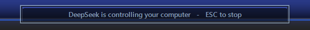
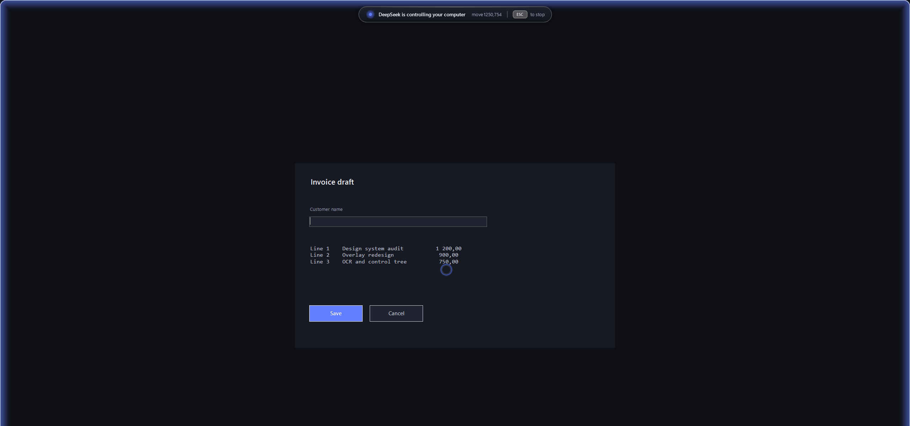
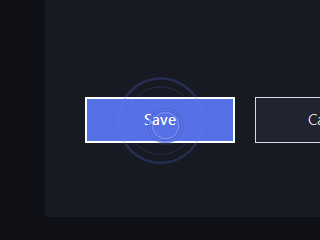

# dsh-computer-use

[](https://github.com/datuloar/dsh-computer-use-win/actions/workflows/ci.yml)
[](LICENSE)


Windows computer use for agents: read the screen **as text**, click controls **by name**,
screenshot, type, scroll, drag — plus an on-screen indicator the human can see and stop with
**ESC**.



A text-only model can drive a GUI with this: `dsh-cu tree` and `dsh-cu read` turn a window into a
few hundred tokens of roles, names and clickable points, and `dsh-cu tap "Save"` clicks the one
control that matches. Screenshots are there when pixels are the answer, not as the only way in.

Built for the [DeepSeek Harness](https://github.com/deepseek-ai/deepseek-harness); the CLI works
with any agent or script. The CLI is `dsh-cu`, the skill it registers is `dsh-computer-use`, the
repository is `dsh-computer-use-win` — three names, one thing.

**Nothing to install.** No packages, no driver, no SDK: the backend compiles its own C#
with the .NET Framework that ships with Windows.

## Why this one

- **Cheap enough for a text-only model.** `tree` reads the control tree through UI Automation
  (native apps, and web pages once the browser's accessibility is woken up), `read` runs the OCR
  that ships with Windows, and both print a clickable point per line. A window costs a few hundred
  tokens instead of a 4 MB screenshot, and no image ever leaves the machine.
- **The human can see it and kill it.** A rounded status panel that names the command being run
  ("click 640,380"), a glow along the screen edge and a ring that follows the real pointer; ESC
  stops everything. Injected ESC is ignored, so an agent cannot switch off its own indicator.
- **One pointer, always.** The ring is drawn *around* your own cursor, so there is never a second
  arrow chasing the first one. `--hide-cursor` is the opt-in for the other model: the drawn marker
  becomes the only pointer on screen.
- **Input is refused while the indicator is down.** `move`, `click`, `drag`, `wheel`, `type`,
  `key`, `keys`, `clipboard` and `run` answer with a refusal until `dsh-cu overlay` has put the
  frame on screen. That gate lives in the tool, not in the prompt.
- **It runs on a stock Windows box.** Other computer-use plugins drive an external native driver
  (cua-driver and friends) that has to be installed first; this one needs only the PowerShell and
  .NET that Windows already has.
- **It is verified against the real machine.** `dsh-cu self-test` exercises every command and
  reports pass/fail; environment-dependent checks (Notepad window, focus) warn instead of lying.
- **Works from inside the Harness sandbox.** The Harness file sandbox blocks piped stdio for
  nested processes; the CLI falls back to file-descriptor capture, so `dsh-cu` still works where
  a naive `spawn(..., {stdio: 'pipe'})` gets `EPERM`.

What it is *not*: it has no browser DOM (UI Automation sees what an app exposes, which is less
than the DOM and more than pixels), no multi-monitor support, and no per-application allowlist.

## Install

| Way | Command | What you get |
|---|---|---|
| Skill + CLI + PATH | `powershell -ExecutionPolicy Bypass -File install.ps1` | `SKILL.md` in `$DSH_HOME\skills\dsh-computer-use\` and a `dsh-cu` shim on the user PATH |
| DSH profile plugin | `dsh plugin --profile web add github:datuloar/dsh-computer-use-win` | the bundle mounts the plugin, which registers the skill from the repository |
| Nothing at all | `bin\dsh-cu.cmd <command>` or `node src\cli.js <command>` from a clone | the same CLI, no PATH change |

Use **one** skill delivery path: the copied `$DSH_HOME\skills\dsh-computer-use\SKILL.md` and the
plugin registration carry the same skill name.

Without any of them: `node src\cli.js <command>` or `bin\dsh-cu.cmd <command>`.

The filesystem skill root is scanned live, so no restart is needed for the copy; the profile
plugin needs `dsh web` restarted once.

## The loop

```powershell
dsh-cu overlay                       # the human is warned for 8 s, ESC cancels
dsh-cu shot                          # capture the screen, print the path
dsh-cu click 640 380                 # click there
dsh-cu type "hello"                  # type into the focused window
dsh-cu keys ctrl+l                   # key combinations
dsh-cu drag 420 300 980 300          # press, glide, release
dsh-cu shot --region 1200 600 420 240   # read one detail instead of the whole screen
dsh-cu overlay --stop                # stop and clean up
```

1. `dsh-cu overlay` before the first input.
2. `dsh-cu focus <pid>` (or `--title <text>`) the target window.
3. `dsh-cu shot` and look at the image.
4. Act on coordinates taken from that screenshot; confirm a `move` with `dsh-cu pos`.
5. `dsh-cu shot` again — a step is done only when the second screenshot says so.
6. `dsh-cu overlay --stop` when finished.

## Commands

    dsh-cu shot [file.png] [--region <x> <y> <w> <h>]   capture the screen, or a crop of it
    dsh-cu read [--region <x> <y> <w> <h>] [--lang <tag>] [--json]   the screen as text, with a point per line
    dsh-cu tree [--pid N | --title <text>] [--depth N] [--all] [--json]   the control tree of a window
    dsh-cu find <text> [--pid N | --title <text>] [--json]   controls whose name contains the text
    dsh-cu tap <text> [--pid N | --title <text>]   click the one control named like that
    dsh-cu move <x> <y>                       move the pointer
    dsh-cu click <x> <y> [left|right|middle|double|triple]   click
    dsh-cu drag <x> <y> <to-x> <to-y>         press, glide to the second point, release
    dsh-cu wheel <delta> [<x> <y>] [--horizontal]   scroll, 120 = one notch, at that point when x y are given
    dsh-cu type <text>                        type into the focused window
    dsh-cu key <name> [down|up]               Enter, Esc, Tab, Space, Ctrl, Alt, F1..F12, arrows
    dsh-cu keys <combo>                       ctrl+l, ctrl+shift+t, ...
    dsh-cu clipboard [get|set <text>|clear]   read or write the clipboard
    dsh-cu pos                                pointer position and foreground window
    dsh-cu windows [--json]                   visible windows with pid, title and rectangle
    dsh-cu focus <pid> | --title <text>       bring a window to the front, verified
    dsh-cu wait-window <text> [seconds]       wait for a window to appear, then focus it
    dsh-cu run <command line>                 run a command line — see the safety rules
    dsh-cu broker [start|stop|status]         elevated input broker, asks for UAC
    dsh-cu overlay [--announce N] [--quiet] [--hide-cursor]   on-screen indicator, ESC stops it
    dsh-cu overlay-state                      whether the indicator is running
    dsh-cu display                            primary screen size and DPI
    dsh-cu mcp                                serve the same tools over MCP (stdio)
    dsh-cu doctor                             what this machine can do
    dsh-cu self-test                          exercise every command
    dsh-cu overlay --stop                     stop the indicator, restore the cursor
    dsh-cu overlay --restore-cursor           emergency cursor rescue

`read`, `tree`, `find` and `tap` are the cheap path; `shot` writes into `%TEMP%\dsh-computer-use\`
and prints `SAVED <path> <bytes>`; `--region x y w h`
crops it to that rectangle in screen coordinates. `--quiet` draws only the pointer marker, for
pixel-accurate reads. Arguments are handed to the backend as a JSON array, so typed text and window
titles keep their spaces, quotes and leading dashes.

`drag` presses at the first point, glides to the second in eased steps and releases it, which is
what sliders, selections and drag-and-drop targets expect; `click` also takes `middle` and
`triple`.

## As MCP tools (DeepSeek Harness, Claude Code, opencode, Cursor)

`dsh-cu mcp` serves every command as native tools over MCP stdio: `ui_tree`, `find`, `tap`,
`read_text`, `screenshot` (returns the image), `click`, `move`, `drag`, `scroll`, `type`, `press`,
`windows`, `focus`, `wait` and `indicator`. It keeps one backend process warm, so a call takes
10–200 ms instead of the ~550 ms a fresh PowerShell costs, and input tools start the on-screen
indicator by themselves the first time.

DeepSeek Harness — add a row to your profile patch (`<DSH_HOME>\profiles\web\cordis.patch.yml`);
the tools then appear as `mcp__pc__click`, `mcp__pc__ui_tree`, ...:

```yaml
- id: mcp-pc
  name: '@deepseek-ai/dsh-mcp-client'
  config:
    serverName: pc
    transport: stdio
    command: node
    args: ['C:\\path\\to\\dsh-computer-use\\src\\mcp.js']
    toolCallTimeoutMs: 120000
```

Claude Code: `claude mcp add pc -- node C:\path\to\dsh-computer-use\src\mcp.js`.
opencode and Cursor take the same command in their MCP settings.

If the human presses ESC, the indicator records it and every input tool refuses for the next ten
minutes with a message telling the agent to stop and ask — an agent cannot quietly restart the
indicator it was just stopped with.

## Driving a GUI without vision

```powershell
dsh-cu overlay                       # the human is warned, ESC cancels
dsh-cu focus --title "Settings"      # pick the window
dsh-cu tree                          # roles, names and a clickable point each
dsh-cu tap "Bluetooth"               # click the one control with that name
dsh-cu tree                          # verify: the tree is the new state
```

`tree` walks the window with UI Automation and prints one line per control:

```
TREE Invoice draft (6 elements, depth 6)
  Text "Invoice draft" @1066,643
  Edit "Customer name" @1250,754
  Button "Save" @1075,1013
  Button "Cancel" @1245,1013
```

`find "save"` filters that list, and `tap "Save"` clicks the single match — or refuses and prints
the candidates when the name is ambiguous, so a wrong click is never silent. Before clicking, `tap`
checks that the point really belongs to the target window and refuses when something covers it.

Chrome, Edge and other Chromium browsers keep their accessibility tree switched off until a client
asks for it; the first `tree` or `find` wakes the renderers and waits for the page, later calls are
immediate. A browser window then lists its links, buttons and fields the same way, which is enough
to drive most web UIs without a DOM. Firefox and Electron apps expose whatever they expose — check
with `tree` before planning a run.

When a window shows no tree (canvas apps, games, remote desktops, a PDF viewer), `read` falls back
to the OCR that ships with Windows:

```
dsh-cu read --region 1200 600 420 240 --lang en-US
READ 3 lines (en-US, 420x240 at 1200,600)
[1310,648] Customer name
[1288,712] Design system audit
[1276,764] Save
```

Each line carries the point to click, small regions are upscaled before recognition, and `--lang`
picks an installed language pack (`dsh-cu read --lang ru`). `doctor` lists what is installed.

A screenshot is still the right tool when the question is about pixels — colours, layout, an image,
a chart. Then `shot --region` keeps it small, and a vision-capable route (for DeepSeek Harness: the
Vision Toolkit plugin) can answer questions about it.

Scrolling follows the pointer, so pass it the page: `dsh-cu wheel -600 1280 700` is five notches
down at that point, `--horizontal` scrolls sideways, and `key PageDown` / `keys ctrl+End` scroll the
focused page. Every scroll moves the coordinates you measured — take a fresh shot before clicking.

## What the human sees



| Countdown before the first input | A click, shown where it landed |
|---|---|
|  |  |

- The panel names the command that is running; typed text is shown as a character count only.
- The edge glow breathes while the agent is in control and is solid during the countdown.
- The ring follows your own pointer and pulses on every click. Screenshots never contain the
  system cursor, which is why only the ring shows up in the images above.

All images on this page were taken over a neutral demo window, not a real desktop.

## Safety model

- **Input is refused while the indicator is down** — and again the moment the indicator process
  dies, so a killed indicator cannot leave the human blind for the seconds the heartbeat stays
  fresh. Override only deliberately: `DSH_CU_ALLOW_NO_INDICATOR=1`.
- **The indicator comes up before input is allowed**, and the CLI waits out the full announcement
  (default 8 s) after the frame is confirmed on screen.
- **ESC stops it** — a physical press only; injected ESC is ignored.
- **The panel says what is happening.** Every command writes a one-line label the indicator shows
  next to the status text, so the human can follow along; `type` is reported as a character count
  rather than the text, so a typed password never appears on screen.
- **`overlay --stop`** kills the indicator by pid file, reloads the system cursors and removes its
  state files. The indicator also stops itself after five minutes without a command.
- **One pointer, never two.** By default nothing replaces your cursor: the indicator draws a ring
  around it, so the pointer you see is the real one and the ring only says "the agent is here".
  `dsh-cu overlay --hide-cursor` is the opt-in for screen sharing and recordings: it blanks the
  system cursor and draws the marker arrow instead, so there is still exactly one pointer. The tool
  records that it blanked the cursor, `overlay --stop` gives it back, and if the indicator is killed
  the next `dsh-cu` command restores it and says so. `dsh-cu doctor` reports `cursor: visible` /
  `replaced by the marker` / `hidden, but not by this tool`.
- **`run` and `broker start` are the escape hatches.** `broker start` raises a UAC prompt and lets
  `run` execute a command line elevated, for windows this process cannot reach (UIPI). Both are
  gated behind the indicator and are meant for explicit human requests — the Harness already has a
  shell, so the only thing they add is elevation.
- **`clipboard get` is gated too**: it can expose whatever the human last copied.
- The skill instructs the agent never to press anything destructive without an explicit request.

## Environment variables

| Variable | What it does |
|---|---|
| `DSH_CU_ALLOW_NO_INDICATOR=1` | let input through while the indicator is down — deliberate override, nothing else bypasses the gate |
| `DSH_CU_UI_SCALE=1.5` | scale the indicator on top of the display DPI, for a 4K panel or weak eyes (0.75–4) |
| `DSH_CU_POWERSHELL=powershell` | the default; set it to another PowerShell only if yours lives elsewhere |
| `DSH_CU_POWERSHELL=pwsh` | run the backend with another PowerShell executable |

## Running from inside a sandboxed agent session

The Harness file sandbox denies nested processes a pipe, so `node`-spawns-`powershell` with
`stdio: 'pipe'` fails with `EPERM` before PowerShell even starts. The CLI detects that exact
failure and re-runs the backend with two file descriptors instead of pipes, so every command keeps
working. If you would rather skip Node entirely, call the backend directly — it takes the same
commands:

```powershell
powershell -NoProfile -ExecutionPolicy Bypass -File backends\windows.ps1 shot C:\temp\shot.png
```

## Limits, stated plainly

- **Windows only.** `doctor` and `self-test` still run elsewhere; every other command refuses.
- **Elevated windows** cannot be driven from a non-elevated process (UIPI) — use `broker start`.
- **The UAC consent dialog and the lock screen are unreachable**: they run on the secure desktop,
  which is neither capturable nor clickable without a signed UIAccess binary.
- **Captchas**: there is no solver in here — no OCR, no model call, no bypass. A checkbox or a
  tile is the same click as any other target, chosen by whoever looked at the screenshot; whether
  clicking it is allowed is between you and the site.
- **Primary monitor only**, in physical pixels. The process claims per-monitor DPI awareness, so a
  screenshot is native resolution and its coordinates are the coordinates `click` expects.
- **The control tree is UI Automation, not the DOM.** It sees what an application exposes: most
  native Windows apps and Chromium browsers do well, some custom-drawn UIs (games, canvases,
  emulators) expose nothing at all. `read` (OCR) and `shot` cover those.
- **Waking a browser's accessibility tree costs the browser some memory and CPU** while it stays
  on, which is the price of reading a page without an extension.
- **OCR is as good as the installed language pack** and no better: it misreads small, low-contrast
  or decorative text. Coordinates it returns are the line's own box, so a click lands on the text,
  not necessarily on the control behind it — prefer `tree`/`tap` where a tree exists.
- Typing runs at 12 ms per character, which is what modern text controls accept reliably; a newline
  is sent as Enter and a tab as Tab. Coordinates outside ±32767 are refused rather than clamped.
- The indicator is drawn on the physical screen. The panel also appears in remote-desktop
  streams; the layered frame does not.

## Troubleshooting

| Symptom | Cause | Fix |
|---|---|---|
| `spawnSync powershell EPERM` | an old version without the file-descriptor fallback, or a different sandbox rule | update; use the direct backend call above |
| `the on-screen indicator is not running` | no `dsh-cu overlay` yet, or it was stopped/ESC'd | run `dsh-cu overlay`, or set `DSH_CU_ALLOW_NO_INDICATOR=1` deliberately |
| The cursor is invisible (only possible if you upgraded from 1.1.0, which blanked it) | that version replaced the system cursors and a killed indicator could leave them blank | `dsh-cu overlay --restore-cursor`; if that does not help, re-apply a pointer scheme in Settings → Mouse → Additional mouse options → Pointers, or sign out and back in |
| `the elevated broker took the command but did not answer` | it is still running that command | wait, then retry if needed; `dsh-cu broker stop` if it is wedged |
| `the backend was stopped after 60s` | a modal dialog or a busy machine blocked the call | look at the screen, dismiss the dialog, retry |
| `capture returned an empty image` | session locked or display asleep | unlock and retry |
| `SendInput delivered 0 of 1 events` | the focused window is elevated | `dsh-cu broker start`, then retry |
| The agent never sees the skill | `$DSH_HOME` is unset, or the skill frontmatter is invalid YAML | `dsh-cu doctor` reports the skill path; `node src\verify.js` validates the frontmatter |

## Development

```powershell
node src\verify.js           # static: skill frontmatter, documented commands, plugin manifest
node test\run.mjs            # node:test suite for the pure parts (frontmatter, command table, contract)
node src\cli.js self-test    # real machine: every command, ~40 s, takes over mouse and keyboard
node src\cli.js doctor
```

`verify` and the test suite touch nothing, so a runner can execute them (see
`.github/workflows/ci.yml`, which calls exactly these two). `self-test` is the invasive one — run it
on a desktop you are willing to hand over for a minute (it opens Notepad, types, clicks and closes
Notepad again). From a sandboxed agent session Notepad cannot start, so those three checks report a
warning instead of failing.

```
src/cli.js              entry point: argv -> one command call, one error path
src/commands.js         the command table: name, args, summary, gate and handler
src/backend.js          the only file that spawns a process or reads a temp path
src/contract.js         static contract check (frontmatter, docs, plugin manifest)
src/selftest.js         checks against the real machine
src/tool-error.js       the error type whose message is meant for the operator
backends/windows.ps1    the PowerShell host: argv, dispatch, indicator lifecycle, broker
backends/csharp/        the C# it compiles, one type per file
lib/index.js            DSH plugin entry: registers the skill
lib/skill.js            the skill registration object, read from SKILL.md
lib/frontmatter.js      the two frontmatter fields the plugin needs
cordis.patch.yml        the bundle patch that mounts the plugin
test/                   node:test suite (test/run.mjs runs it in one process)
SKILL.md                agent-facing skill: when to use it, the loop, the safety rules
AGENTS.md               index for a coding agent: layout, entry points, rules easy to break
install.ps1             one-command install
```

## Getting it into the plugin market

The market is the `dshmarket` plugin (Settings → **Plugin Market**); its catalog comes from
[curated PRs](https://github.com/awesome-dsh-plugin/awesome-dsh-plugin), and the catalog installs a
plugin either from a package registry or straight from its GitHub repository — this one uses the
repository, so there is nothing to publish first.

| Step | State |
|---|---|
| GitHub repository | [datuloar/dsh-computer-use-win](https://github.com/datuloar/dsh-computer-use-win) — public, branch `main` |
| `dsh.bundle.patch` + plugin entry | in the repository, so the bundle mounts and registers the skill |
| Install path | `dsh plugin --profile web add github:datuloar/dsh-computer-use-win` |
| Repository metadata | add the `dsh-plugin` topic and a one-line description on GitHub |
| Catalog PR | one file `data/plugins/datuloar__dsh-computer-use-win.yml` with `url`, `name`, `category: tools` and a bilingual `description` |

The catalog entry itself, ready to paste into that PR:

```yaml
url: https://github.com/datuloar/dsh-computer-use-win
name: datuloar/dsh-computer-use-win
category: tools
description:
  en: Windows computer use for DeepSeek Harness agents — screenshot, click, type, scroll and focus windows, with an on-screen indicator the human can see and stop with ESC. No dependencies and no driver to install.
```

CI in the catalog wants a `dsh.bundle`, real working code, a repository at least a day old and a
description that matches the code. Optional but recommended: a `screenshots.json` next to
`package.json` (1–8 GitHub-hosted images) so the card shows curated shots instead of scraping this
README — `docs/indicator.png` is the one shot this repository ships.

If the CLI is ever renamed, three places move together: `bin` in `package.json`, the exported `name`
in `lib/index.js`, and the `id`/`name` in `cordis.patch.yml`; the skill keeps its own name
`dsh-computer-use`, which is what `$DSH_HOME\skills\` and the catalog show. `node src\verify.js`
fails if they disagree.

Note that `os: ["win32"]` makes the package manager refuse the install on macOS and Linux, while the
catalog has no Windows-only flag — the market will still show the card to everyone.

## License

MIT
